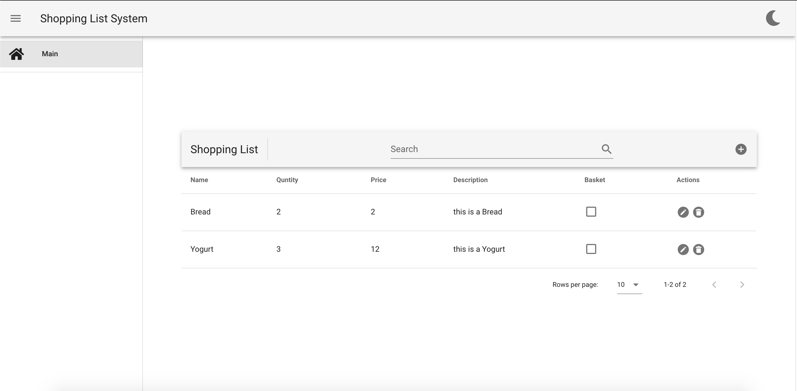

# ShoppingCart

# Description 

ShoppingCart is a Vue based App 
In general i have based on the ApiShift library , 
used Vuetify for the ui .
In ApiShift there is 4 classes:
APIManager: Turning on the system 
APIHandler : Tools to communicate with the server
Loader : A system the enable suitable and comfy loads
Server: The Dummy server any function represent a request
InMemoryDB: Dummy database inside the memory

# Product Functions

●Ability to add new products to the list.

●Ability to delete products.

●Ability to edit product - Edit text and mark a product added to the basket

●When the user clicks on a product, the product details form will be displayed with the Ability to edit

# Photos

